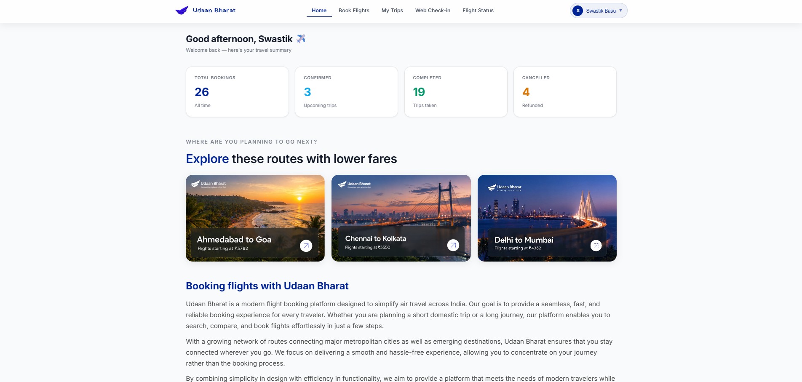
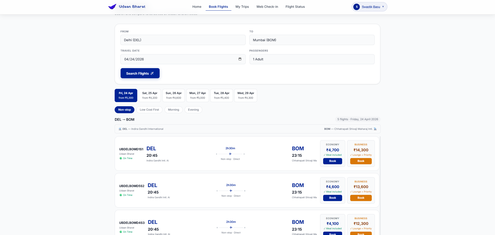
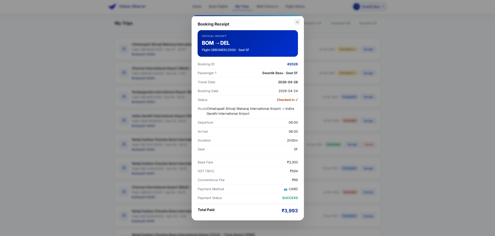
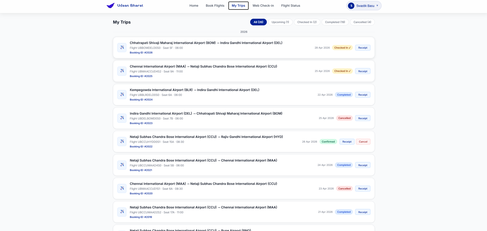
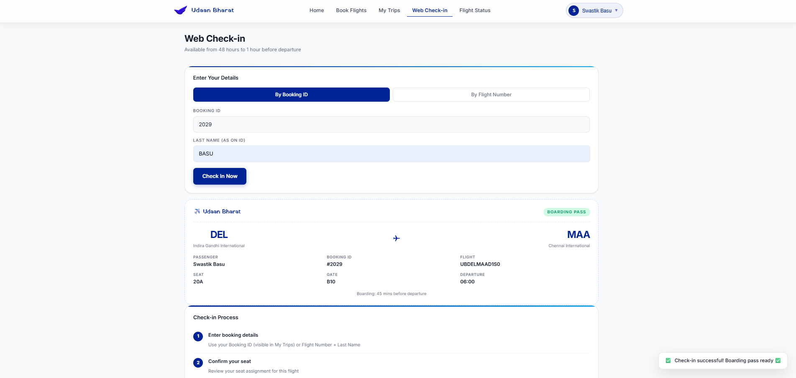

# ✈️ Udaan Bharat — Flight Booking System

A modern full-stack flight booking web application that allows users to search flights, book tickets, manage trips, perform web check-in, and receive PDF tickets via email.

---

## 🚀 Live Features

* 🔍 **Flight Search** across multiple Indian routes
* ✈️ **Real-time Booking System**
* 🎫 **PDF Ticket Generation & Email Delivery**
* 🧳 **My Trips Management Dashboard**
* ✅ **Web Check-in System**
* 📊 **Interactive Dashboard Overview**
* 🧭 **Smart Route Suggestions (Explore Section)**
* 💎 **Modern UI with Glassmorphism Navbar**

---

## 🛠️ Tech Stack

### 💻 Frontend

* HTML5
* CSS3 (Custom UI + Glassmorphism Design)
* Vanilla JavaScript

### ⚙️ Backend

* Spring Boot (Java)
* REST APIs
* Java Mail Sender (PDF tickets via email)

---

## 📂 Project Structure

```
Udaan-Bharat-Flight-System/
├── frontend/   # UI (HTML, CSS, JS)
├── backend/    # Spring Boot backend
├── README.md
```

---

## ⚙️ How to Run Locally

### 🔹 Backend (Spring Boot)

1. Open `backend` folder in VS Code
2. Navigate to:

```
src/main/java/.../AirlineApplication.java
```

3. Click **Run ▶️**

Server will start at:

```
http://localhost:8080
```

---

### 🔹 Frontend

1. Open `frontend/index.html`
2. Run using:

   * Live Server OR
   * Direct browser open

---

## 📸 Screenshots

### 🏠 Dashboard



### ✈️ Booking Flights



### 🎫 Booking Receipt



### 🧳 My Trips



### ✅ Web Check-in



---

## 🌟 Key Highlights

* Clean and modern UI design
* End-to-end booking workflow
* Email integration with PDF generation
* Responsive layout
* Structured full-stack architecture

---

## 👨‍💻 Author

**Swastik Basu**

---

## 📌 Note

This project was developed as part of a full-stack learning and software engineering practice. It demonstrates real-world concepts including API integration, UI design, and backend communication.


